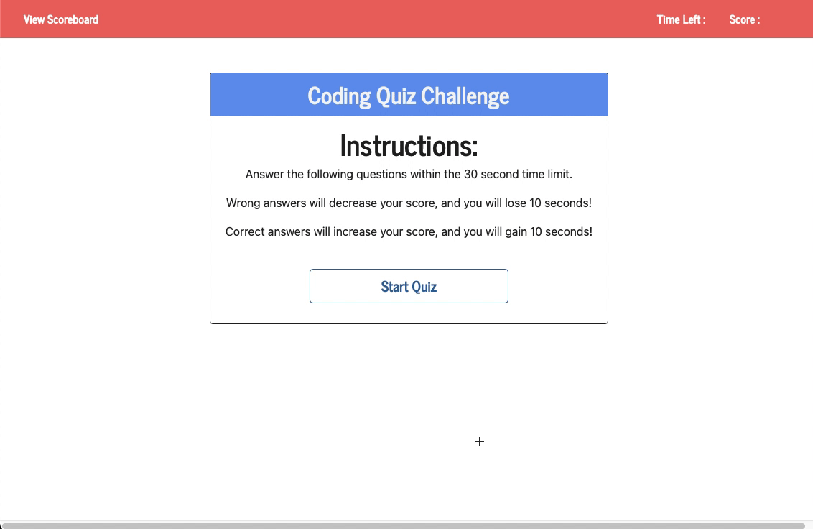

# Code-Quiz

# Desctiption
Homework assignment featuring dynamically updated HTML and CSS powered by JavaScript.

# Table of Contents
  * [Development](#Development)
  * [License](#License)
  * [Screen Recording](#Screen-Recording)
  * [Questions](#Questions)
  * [Application](#Application)

# Development

To help with CSS, I used [Bootswatch](https://bootswatch.com/journal), which has a collection themes powered by [Bootstrap](https://getbootstrap.com).

For inspiration for questions I resourced [W3schools](https://www.w3schools.com/quiztest/quiztest.asp?qtest=JS).

# License

# Screen Recording

Example of how deployed application should run:

# Application

For deployed application,

[Click Here](https://kuyajasper.github.io/Code-Quiz)

# Questions

Reach out at:

